  <picture>
    <source media="(prefers-color-scheme: dark)" srcset="./assets/dark.svg">
    <source media="(prefers-color-scheme: light)" srcset="./assets/light.svg">
    
  </picture>

<h3 align="center">Software & Machine Learning Engineer | B.Tech CSE @ IIIT Manipur</h3>

  I am a developer focused on core CS fundamentals, low-level architecture, and performance-driven development. I enjoy building full-stack systems from scratch, optimizing logic, and turning complex ideas into scalable solutions.
   
  <a href="https://anantmob.netlify.app"><strong>Explore My Portfolio »</strong></a>

  
  

---

### Current Focus

*   **Academics & Mentorship:** Maintaining a strong academic performance (8.68 CGPA) while mentoring peers in programming concepts and collaborating on open-source codebases[cite: 2].
*   **Problem Solving:** Strengthening algorithmic logic on LeetCode (**355+ solved**, Max Rating: **1510**) with a focus on Dynamic Programming, Graphs, Binary Search, and Greedy Algorithms[cite: 2].
*   **Hackathons:** Engaging in intense algorithmic and development challenges for competitions like Pathway × IIT Ropar, Ethos 2025 (IIT Guwahati), and the GDG Solution Challenge[cite: 2].
*   **Development:** Engineering real-world, full-stack projects with clean design, caching, and scalability in mind[cite: 2].

---

### Tech Stack

  
<b>Languages & Core</b>

   
  
  
  
  
  
  
  

  
<b>Frameworks & Tools</b>

   
  
  
  
  
  
  
  
  
  

  
<b>Data, Machine Learning & Libraries</b>

   
  
  
  
  
  
  
  

---

### Featured Projects

| Project | Description | Tech Stack |
| :--- | :--- | :--- |
| **AI Learning Path Generator** | A dynamic roadmap generator using the Gemini API to output structured Directed Acyclic Graphs with an interactive UI. Utilizes Redis caching and PostgreSQL to optimize API costs[cite: 2]. | `Next.js`, `FastAPI`, `PostgreSQL`, `Redis`, `Gemini`, `React Flow` |
| **Ahouba.com (Techfest Website)** | IIIT Manipur's official techfest website. An immersive, "game-like" 3D environment with basic physics, character controls, and high-performance 2D GSAP animations[cite: 2].  🔗 **[Live Demo](https://ahouba.com)** | `React.js`, `Three.js`, `GSAP`, `Blender` |
| **Rocket Simulator** | A physics-based simulator modeling core aerodynamic and astrodynamic equations to accurately calculate trajectory and propulsion mechanics in real-time[cite: 2]. | `C++`, `Raylib`, `OOP` |
| **2D Space Game** | An interactive space dodge game with real-time collision detection, dynamic scoring, and an optimized rendering pipeline handling multiple moving objects at a sustained 60 FPS[cite: 2].  🔗 **[Live Demo](https://mobx01.github.io/space-io)** | `JavaScript`, `HTML5 Canvas`, `CSS` |
| **Event-Driven Route Optimization** | An event-driven route optimization system built for the GDG on Campus Solution Challenge (2025) to effectively model, optimize, and solve complex real-world logistical routing problems[cite: 2]. | `Algorithms`, `System Design` |

---

### GitHub Analytics

  

  <!-- Primary Stats -->
  
  

 

  <!-- Streak Stats using the highly stable Heroku endpoint -->
  

 

  <!-- GitHub Trophies -->
  

 

  <!-- Top Contributed Repo -->
  

   
  <i>“Build it. Break it. Optimize it.”</i>
   
  

